<div align="center">
  
  
  
  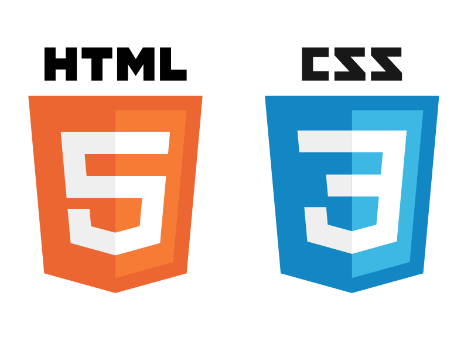
  

# Project Management Application
</div>

This is a Kanban / Scrum style project management tool which can be used to manage all kinds of tasks. 
Admins can create projects, assign managers and developers to them which can then suggest and accept different tasks, 
set a due dates, store time estimates in them and track how much time has already been spent on a certain task.

## User Role Concept
### Managers
Have a dashboard where they can see
- the current progress of their projects
- a list of all tasks sorted by due date
- tasks that their developers suggested
- tasks that are not scheduled yet or don't have an assignee

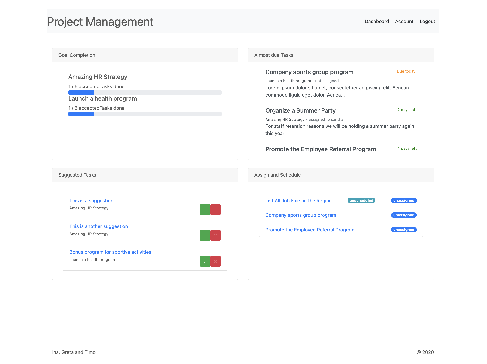

Can have a closer look at their different projects
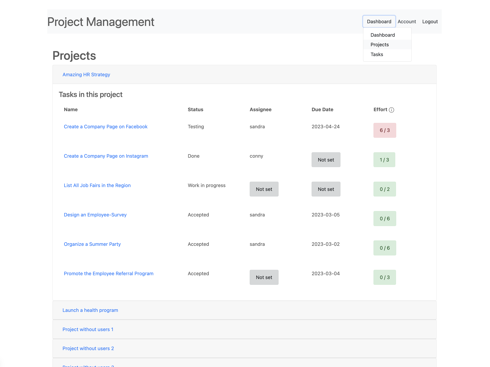

View a list of all tasks


### Developers
Have a dashboard where they can see
- the current progress of their projects
- all tasks assigned to themselves
- tasks that they suggested to the manager
- open tasks that don't have an assignee yet
- 
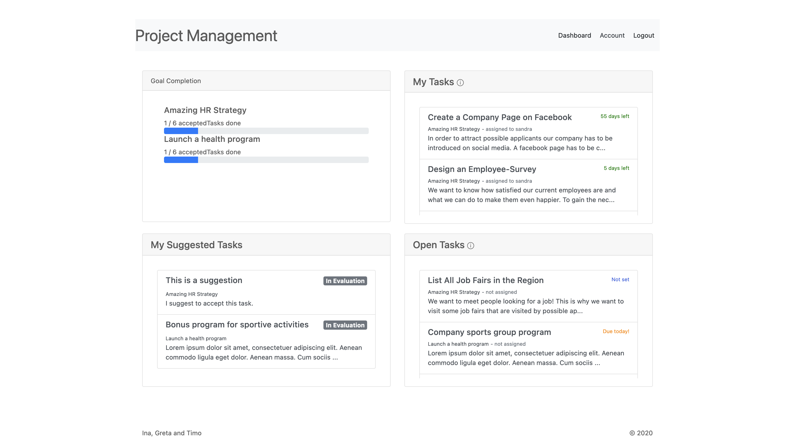

Can have a closer look at their different projects


Suggest a new task from out of the project view and store a time estimate in it
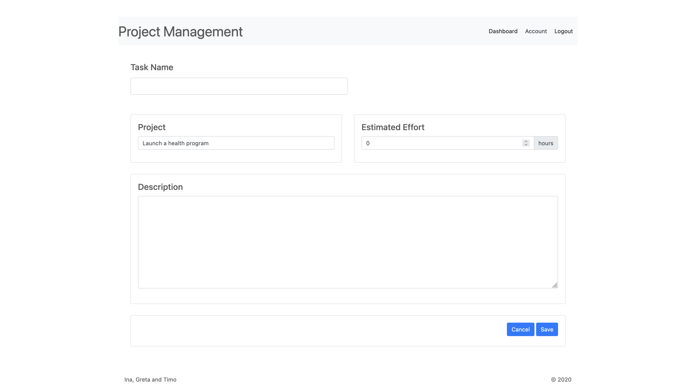

View a list of all tasks
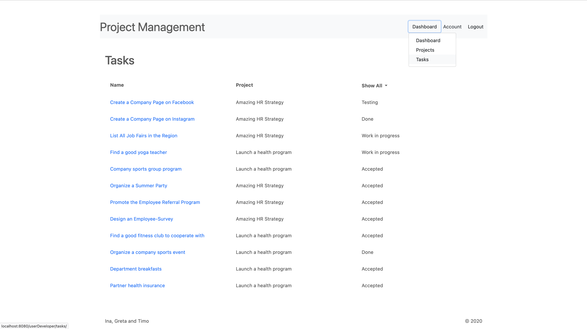

See the details of a task. This includes seeing other developers time estimates and edit it if necessary. Also it's possible to book times on a task.


Edit a task, e.g. change the status (idea, planned, in progress, in test, done), the description or the title.
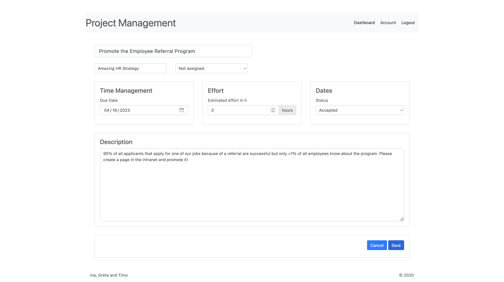

Book times spent on a task (this booking applies to each task and developer, and a developer can book times several times if the processing takes several days, for example)
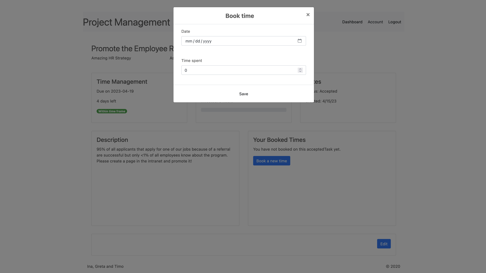


### Admins
Have a dashboard where they can see all projects without members and all users without projects
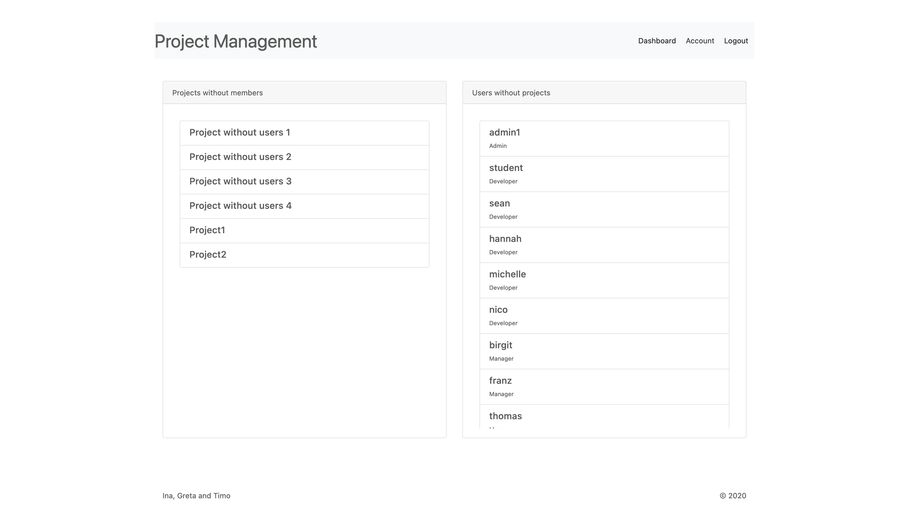

View all users
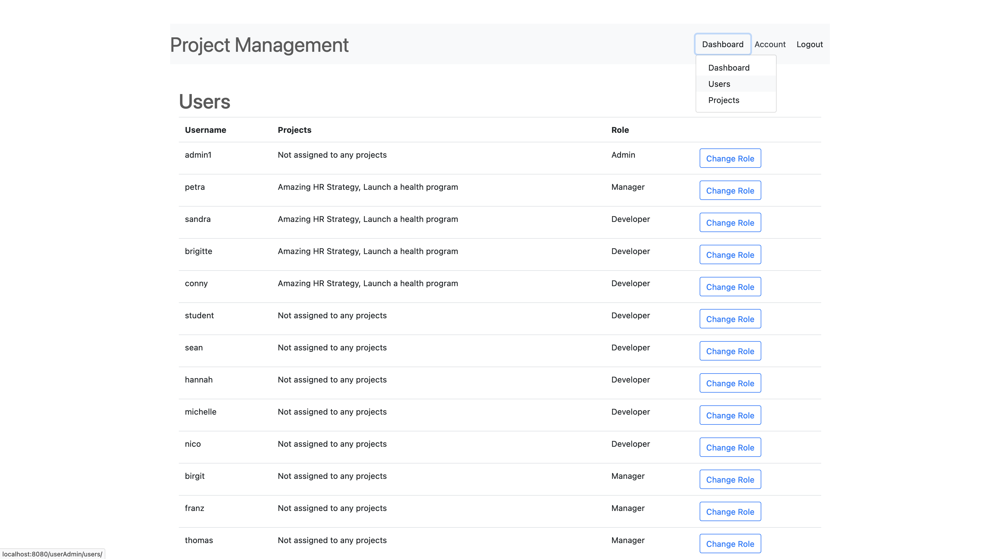

Change the roles of other users: there is admin, developer and manager
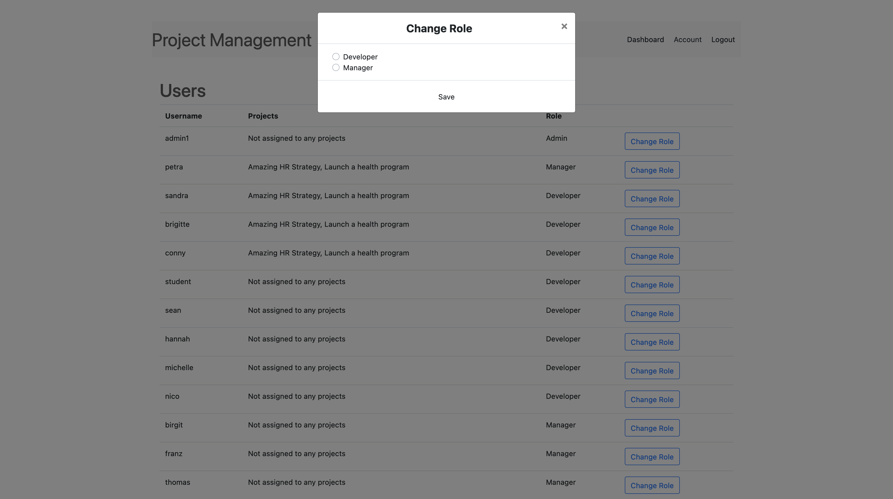

View all projects
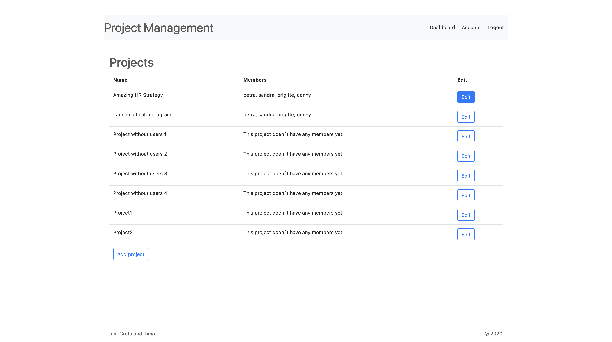

Edit projects and add / remove other users (of any role) to projects
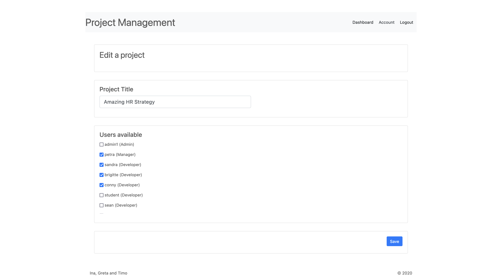

Create new projects
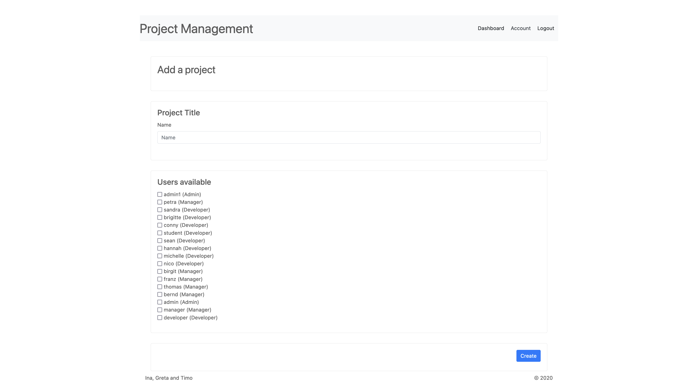


### All Users
- Register and get the role "developer" by default,
- Change  their password


| Type           | Parameter           | Description                                 |
|----------------|---------------------|---------------------------------------------|
| DB config      | server              | Server                                      |
|                | port                | Port                                        |
|                | password            | Password                                    |
|                | database            | Name of the db schema                       |
|                | named_instance      | Boolean flag                                |
|                | named_instance_name | Name of the instance                        | 
|                |                     |                                             |
| Style config   | activation_style    | Name of the folder containing the css file  |
|                |                     |                                             |
| Printer config | printer_name        | Name of the printer                         |
|                | page_height         | Height of the page in floating point number |
|                | page_width          | Height of the page in floating point number |

## Requirements
### Java
Make sure you've got a Raspberry Pi or some other kind of armhf machine.
  ```sh
  sudo apt update
  ```

### Gradle
Make sure you've got a Raspberry Pi or some other kind of armhf machine.
  ```sh
  sudo apt update
  ```

### Database Setup
More information on the underlying database schema will be provided soon.

## Prepared Data To Get You Started
Just execute start.sh :)


https://www.iloveimg.com/download/31vjvvf0vw229jzxkc9chnf46587lbpg5fvnq49kr25gbp9gyt7th5jdwm1jfw8b7n8d9h6cf766p3w2bpm5nlbprwk76v717sf554w0dA5hd9c3cmpsfmpx02x4lv3qjhA13vyncblbxcvjth07t7zrmd90bw9pfzwxqz7v2fx0311msjt1/1