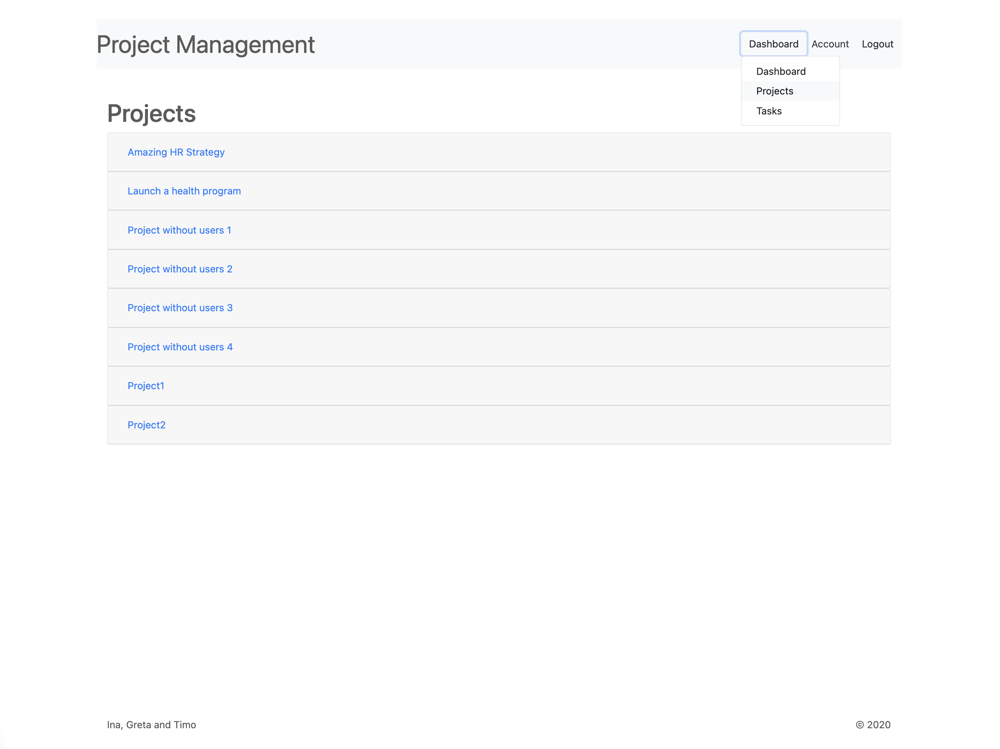

# Project Management Application
This is a Kanban / Scrum style project management tool which can be used to manage all kinds of tasks. 
Admins can create projects, assign managers and developers to them which can then suggest and accept different tasks, 
set a due dates, store time estimates in them and track how much time has already been spent on a certain task.

## User Role Concept
### Managers
Have a dashboard where they can see
- the current progress of their projects
- a list of all tasks sorted by due date
- tasks that their developers suggested
- tasks that are not scheduled yet or don't have an assignee

Have a closer look at their different projects

View all tasks

### Developer
- Add a task to this project, this includes at least a title and a description.
- Store a time estimate (roughly in hours) in a task
- See other developers estimates and edit it if necessary
- Change the status of a task (idea, planned, in progress, in test, done)
- Book times spent on a task (this booking applies to each task and developer, and a developer can book times several times if the processing takes several days, for example)
- See how much time I have booked in total across all tasks (but not the times of other developers)

### Admins
- Change the roles of other users: there is admin, developer and manager
- Create a new project
- Add other users (of any role) to my project
- Remove other users (any role) from my project